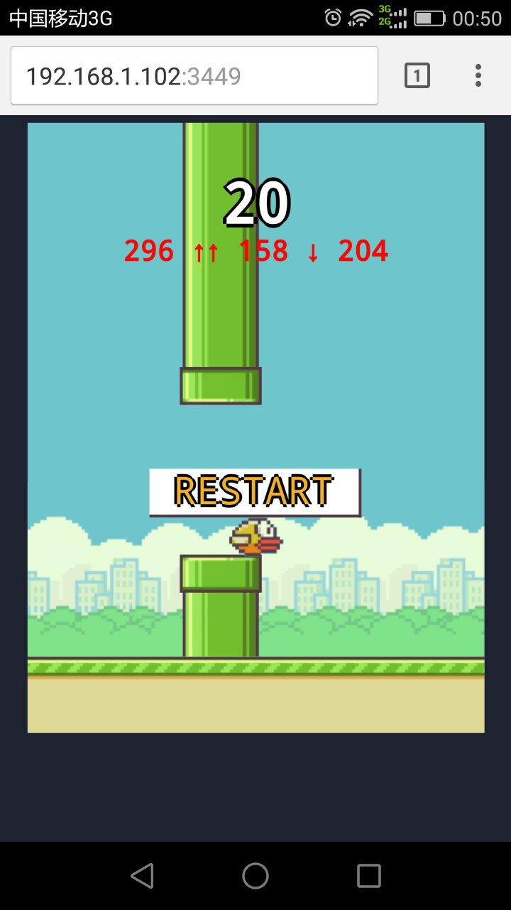

# flappy-bird-demo

Read the [blog post](http://rigsomelight.com/2014/05/01/interactive-programming-flappy-bird-clojurescript.html) about this flappy bird demo.

Watch the 6 minute [video](https://www.youtube.com/watch?v=KZjFVdU8VLI)

Checkout the documentation on [lein-figwheel](https://github.com/bhauman/lein-figwheel) to go further!

## Emacs `C-x C-e`
```elisp
(defun cljs-client-start ()
  (interactive)
  (progn
    (insert "(use 'figwheel-sidecar.repl-api)\n")
    (insert "(cljs-repl)\n")
    (sleep-for 2)
    (rename-buffer (replace-regexp-in-string " " " CLJS " (buffer-name)))
    )
  )

(defun cljs-eval-sexp (sexp)
  (interactive "sClJS-EVAL:")
  (cider-interactive-eval sexp)
  )
(define-key global-map (kbd "M-\"") 'cljs-eval-sexp)

```
## 加了提示之后

## TODOS:
* 1. 设置难易程度的关卡
* 2. 越南的提示越少,变化越大,闯关时间越长
## License

Copyright © 2014 Bruce Hauman

Distributed under the [Eclipse Public License](LICENSE) either version 1.0 or any
later version.
